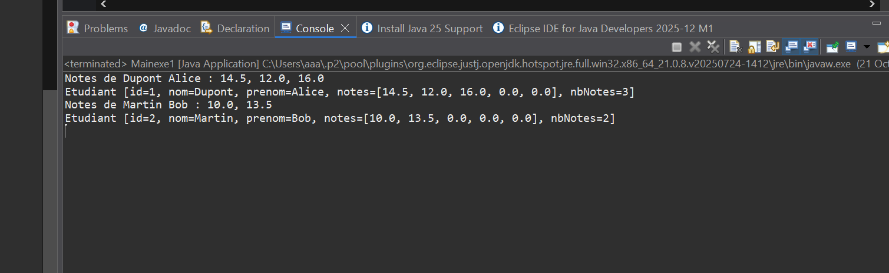
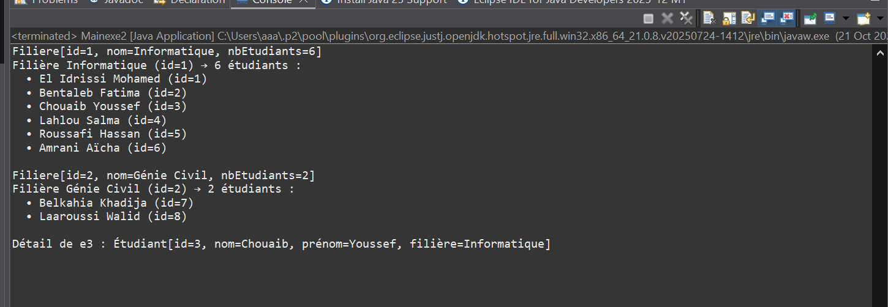
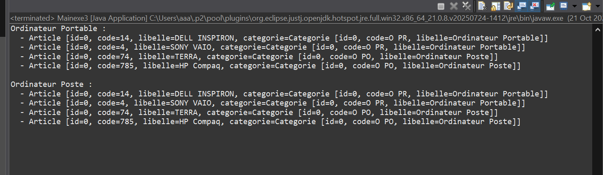
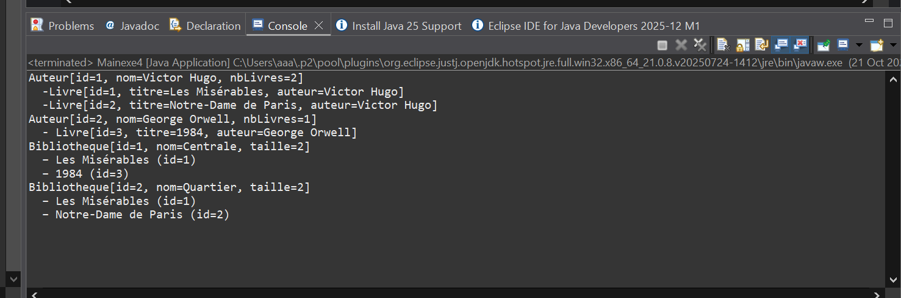

les capture d'ecrants du tp4 du java 
# 🧠 TP4 - Programmation java

Ce projet contient les exercices du TP4 en java.

## 📸 Captures d’écran

Voici les résultats d’exécution :






---

## ⚙️ Compilation
```bash
g++ main.cpp -o main
./main


